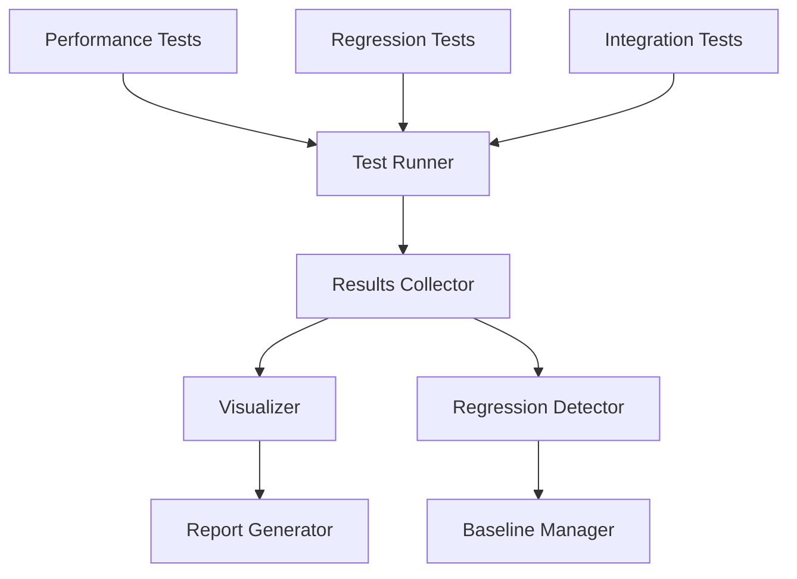
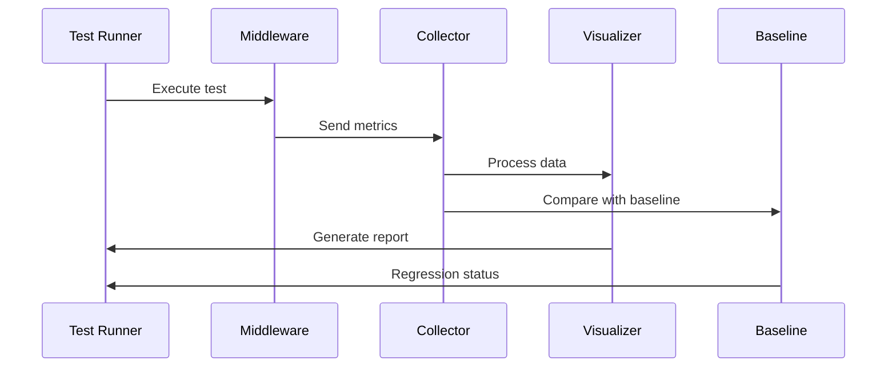
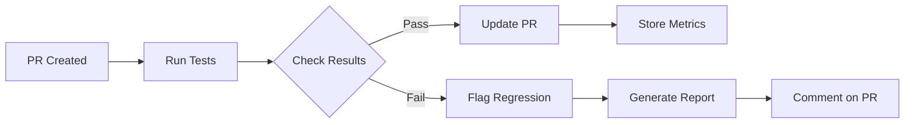
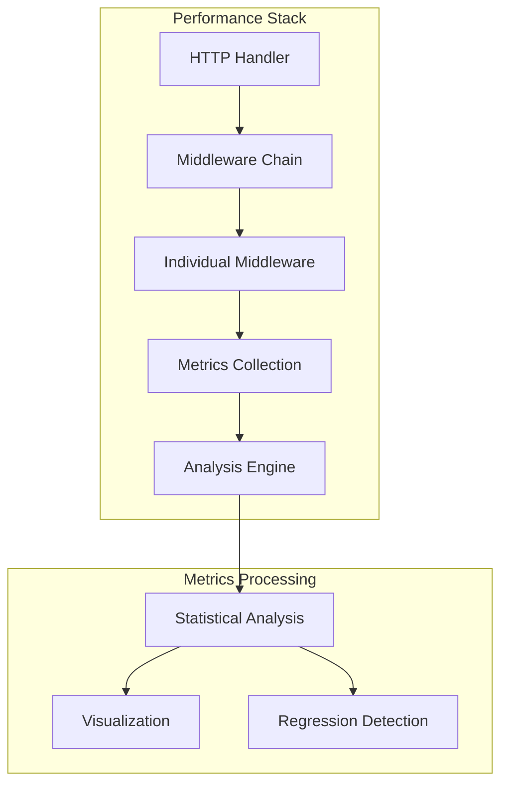
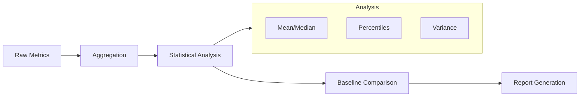

# Performance Testing Suite

This directory contains comprehensive performance testing tools for the proxy server's middleware components. The suite includes standard performance tests, regression detection, visualization tools, and CI integration.

## Architecture

### Test Suite Components



### Data Flow



### CI Pipeline



## Overview

The testing suite consists of several components:
- Performance tests (`test_middleware_performance.py`)
- Regression detection (`test_middleware_regression.py`)
- Performance visualization (`middleware_perf_visualizer.py`)
- Integration tests (`test_middleware_integration.py`)

## Running Tests

### Basic Performance Tests

```bash
# Run all performance tests
pytest tests/proxy/server/handlers/test_middleware_performance.py -v

# Run specific test categories
pytest -m benchmark tests/proxy/server/handlers/test_middleware_performance.py
```

### Regression Tests

```bash
# Run regression tests against baseline
pytest tests/proxy/server/handlers/test_middleware_regression.py -v

# Update performance baseline
BASELINE_UPDATE=true pytest tests/proxy/server/handlers/test_middleware_regression.py
```

### Integration Tests

```bash
# Run integration tests
pytest tests/proxy/server/handlers/test_middleware_integration.py -v
```

## Performance Metrics

The suite tracks several key performance metrics:

1. Throughput
   - Requests per second
   - Data transfer rate
   - Connection handling capacity

2. Latency
   - Mean response time
   - P95/P99 latencies
   - Request processing time

3. Resource Usage
   - Memory consumption
   - CPU utilization
   - File descriptor usage

4. Stability
   - Variance in measurements
   - Error rates
   - Resource leaks

## Technical Details

### Middleware Performance Stack



### Test Data Processing



## Visualization

The visualization tools provide several ways to analyze performance:

```python
from middleware_perf_visualizer import create_visualization

# Generate performance report
test_results = {
    "throughput": 1000,
    "latency_p95": 0.005,
    "memory_usage": 50 * 1024 * 1024
}
report_path = create_visualization(test_results)
```

### Available Charts
- Execution time distributions
- Throughput comparisons
- Memory usage over time
- Latency heatmaps

## CI Integration

Performance tests are automatically run in CI:

1. On pull requests:
   - Runs performance tests
   - Compares against baseline
   - Comments results on PR
   - Flags regressions

2. On main branch:
   - Updates performance baselines
   - Generates trend reports
   - Archives results

### Configuration

Adjust thresholds in `.github/workflows/performance.yml`:

```yaml
env:
  PERFORMANCE_THRESHOLD: 15  # Maximum allowed regression (%)
  MIN_THROUGHPUT: 1000      # Minimum acceptable req/s
  MAX_LATENCY: 10          # Maximum acceptable P95 latency (ms)
```

## Best Practices

1. Running Tests
   - Use isolated environments
   - Run multiple iterations
   - Warm up before testing
   - Monitor system resources

2. Analyzing Results
   - Check for statistical significance
   - Consider environmental factors
   - Look for patterns in regressions
   - Monitor trends over time

3. Maintaining Baselines
   - Update regularly
   - Document significant changes
   - Keep historical data
   - Validate new baselines

4. Troubleshooting
   - Check system load
   - Verify test environment
   - Monitor resource usage
   - Review error logs

## Extending the Suite

### Adding New Tests

1. Create test file:
```python
@pytest.mark.benchmark
async def test_new_scenario():
    # Test implementation
    ...
```

2. Add visualization:
```python
visualizer = PerformanceVisualizer()
visualizer.plot_custom_metric(data)
```

3. Update regression checks:
```python
regression_tester.add_metric(
    name="new_metric",
    threshold=0.1
)
```

### Custom Metrics

Add new metrics in `TimingMiddleware`:

```python
class CustomTimingMiddleware(TimingMiddleware):
    def __init__(self):
        super().__init__()
        self.custom_metrics = []
    
    async def __call__(self, request):
        # Custom metric collection
        ...
```

## Troubleshooting

Common issues and solutions:

1. Unstable Results
   - Increase sample size
   - Check system load
   - Isolate test environment
   - Use statistical smoothing

2. False Positives
   - Adjust thresholds
   - Verify baseline validity
   - Check for environmental factors
   - Use trend analysis

3. CI Failures
   - Check resource limits
   - Verify dependencies
   - Review test logs
   - Check system metrics

## Contributing

When adding or modifying tests:

1. Document changes
2. Update baselines
3. Verify visualizations
4. Test CI integration
5. Review performance impact

For more information, see the main project README.
